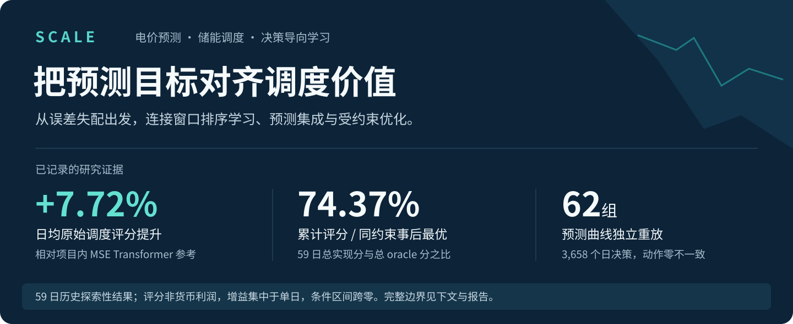
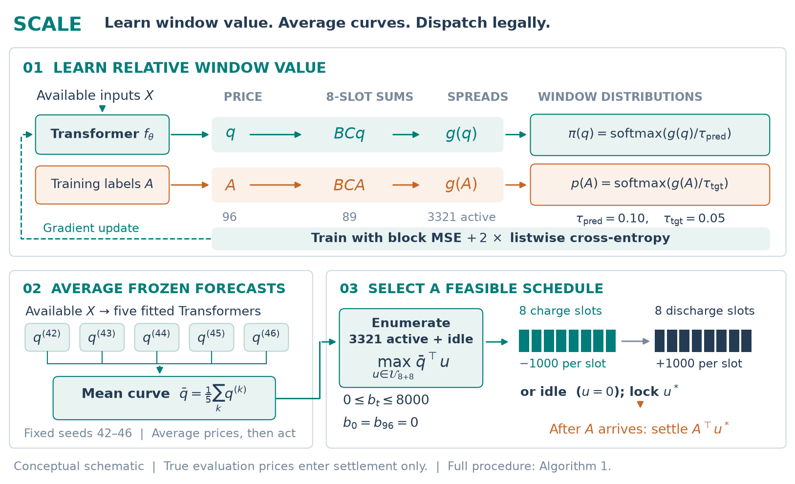

# 面向电力现货交易的电价预测与储能调度优化

宋玉凯 · 匹兹堡大学电气与计算机工程博士候选人 · 独立研究项目（2026.05–2026.09）

[中文报告 · 已公开版](report/pdf/dispatch_value_report_zh.pdf)　/　[English](README_EN.md)　/　[方法与代码](#方法与代码)　/　[复现入口](#报告与复现)　/　[个人主页](https://ys3493-web.github.io/)



电价预测的价值，最终体现在它能否支持更好的充放电决策。本项目从“较低预测误差未必对应较高调度评分”的观测出发，分析可行动作如何决定预测中真正重要的价格对比，进而实现窗口排序学习、五种子预测集成与精确枚举调度。

研究围绕一条可核查的主线展开：**发现评价失配 → 从约束结构解释 → 实现决策导向学习 → 按真实价格重放验证。**

## 研究判断：预测误差与决策价值需要分别检验

对同一 59 日、同一动作集合，项目中两条已保存的 Transformer 预测曲线呈现了一个反例：

| 已保存的候选 | RMSE（越低越好） | 真实价格结算的日均调度评分（越高越好） |
| :-- | --: | --: |
| v1 contextual Transformer | 0.519558 | 5,637.17 |
| v2 contextual Transformer | 0.682788 | 6,214.36 |

较低 RMSE 没有选出较高调度评分的候选。这里比较的是不同训练配方的历史记录，不是单因素控制实验。

原因可以从约束解释：当前动作等量充放电，整体价格平移会改变 RMSE，却不改变充放电窗口价差；动作选择更直接地取决于合法窗口之间的相对价值。报告进一步从可行动作差方向给出决策遗憾上界，同时保留条件均值在理想总体 MSE 条件下的最优性边界。

这使研究问题从“用哪个预测模型”，推进到“在有限数据与模型能力下，怎样训练和评价预测器，才能更贴近下游决策”。

## SCALE：从学习目标到合法调度

SCALE（Storage-dispatch Curve Averaging and Listwise Estimation）是本项目已实现流程的简称：面向储能调度的窗口排序与集成预测。

[](docs/assets/scale_method_overview_20260917.png)

图 1｜与 2026 年 9 月 17 日中英文技术报告一致，点击可放大。

1. **学习窗口价值。** 由 96 点电价预测得到 89 个重叠八时段块和，构造 3,321 个充放电窗口价差；结合日中心块和回归与 listwise 软排序监督，使训练关注下游动作估值。
2. **先平均预测，再作决策。** 五个固定种子（42–46）的 Transformer 输出先按价格曲线平均，再交给同一求解器，避免直接平均离散动作造成不合法计划。
3. **由求解器保证简化约束。** 精确枚举 3,321 个非空闲方案及空闲动作；在离散任务单位下满足容量上限 8,000、先充后放和日末归零。真实评价价格只在动作锁定后用于结算。

方法把已有排序学习、曲线集成思想与本任务动作结构结合。这里的贡献是具体建模、实现与评价，不宣称提出新的通用损失理论或通用优化求解器。

## 结果：同一时期、同一约束、同一结算口径

以下均为 2025 年 11–12 月的 59 日历史探索性回测。评价期曾在早期研究中被查看；最终集成的配方、种子与组合规则在集成评分前固定。

| 方案 | 日均原始调度评分 | 累计评分 / 同约束事后最优评分 |
| :-- | --: | --: |
| 项目内 LightGBM 基线 | 5,786.10 | 64.28% |
| 项目内 MSE Transformer 参考 | 6,214.36 | 69.04% |
| SCALE：listwise Transformer 五种子曲线平均 | **6,693.88** | **74.37%** |
| 预知真实价格的事后最优（oracle，仅作上界） | 9,000.89 | 100.00% |

相对 MSE Transformer 参考，观测日均增量为 479.51（7.72%）。累计比值按“总实现分 / 总 oracle 分”计算，不是逐日比例的简单平均。

> 结果边界：净增量的 86.0% 来自单日；配对七日块 95% 条件重采样区间为 [−227.87, 1,626.28]，跨过零。SCALE 的最差单日为 −5,922.66，参考为 −2,340.48。因此，当前证据支持本时段的观测改善，尚未证明跨时期稳定优势、尾部风险改善或损失函数的独立因果贡献。评分不是人民币或扣除成本后的交易净利润。

数值入口：[聚合结果](report/shared/data/summary.json) · [逐曲线重放核验](audit_records/solver_replay.json) · [完整讨论与对照](report/pdf/dispatch_value_report_zh.pdf)

## 方法与代码

本项目独立完成问题分析、特征与模型实验、调度接口、结果复核及技术报告。下面按研究环节给出实现入口，便于直接核查。

| 环节 | 实际工作 | 代码与证据 |
| :-- | :-- | :-- |
| 时序输入 | 以 67 维上下文特征预测次日 96 点实时电价；区分历史信息与预测边界输入 | [特征构建](src/phase_b/features.py) · [日期切分](src/phase_b/splits.py) |
| 决策导向学习 | 日中心块和回归、窗口软排序；保留其他损失路线作比较 | [训练损失](experiments/holdout_dfl_ltr_v1/loss.py) |
| 集成与动作接口 | 固定配方和五种子重拟合，平均价格曲线后求解 | [集成实验](experiments/holdout_seed_bag_v1/run.py) · [组合方式](experiments/holdout_seed_bag_v1/combine.py) |
| 约束与精确求解 | 枚举合法动作，确定性处理近同分，检查动作结构 | [调度器](src/phase_b/dispatch.py) · [动作校验](src/phase_b/contracts.py) |
| 可核查评价 | 独立重放 62 组预测曲线 × 59 日，核对动作与真实价格结算；分析极端日与区块重采样 | [独立核验脚本](tools/independent_audit.py) · [历史审计记录](AUDIT.md) |

已有重放记录中，62 组曲线共 3,658 个日决策的动作零不一致，结算数值差异不超过 1.5 × 10⁻¹¹。这里核验的是实现与记录的一致性，不是对未来收益的保证。

## 面向实际电力场景的后续验证

这项研究形成了从预测、约束求解到实际结算的评价接口，可作为进一步研究电力交易辅助决策的起点。下一步需要将验证扩展到：

- 信息可用性：核实各输入在决策时刻的实际发布时间，在未参与开发的滚动时段评价固定方案。
- 设备与市场约束：加入充放电效率、衰减成本、真实功率及结算规则，重新定义可行集与收益。
- 风险目标：根据业务需求加入下行或尾部风险约束，并与风险中性目标作配对比较。

以上为后续研究方向。当前成果是公开数据上的离线研究原型，尚无生产部署、真实交易收益或电网运行成效的验证。

## 报告与复现

本页的方法示意与约束解释已按 2026 年 9 月 17 日修订稿对齐。目前仓库可下载的 PDF 为此前发布的复现快照（中文 16 页、英文 18 页）；其中关于简化容量约束和数据来源的表述，请结合下方版本说明阅读。

| 阅读与使用 | 入口 |
| :-- | :-- |
| 已公开报告存档 | [中文报告](report/pdf/dispatch_value_report_zh.pdf) · [English report](report/pdf/dispatch_value_report_en.pdf) |
| 本地核查与重建 | [图表与报告构建](tools/build_report.py) · [数值核查](tools/check_numbers.py) |
| 获取数据与重跑实验 | [数据说明](DATA.md) · [依赖](requirements-full.txt) |

版本说明：本页所用的 8+8 动作集合隐式满足离散容量上限和日末归零；按修订稿引用的赛题描述，数据来自蒙西地区某匿名节点。旧报告与历史审计中较笼统的“未实施容量约束”“未认定市场来源”表述，应结合这两点澄清阅读。

<details>
<summary>展开：已公开报告快照的复现入口</summary>

```bash
pip install -r requirements.txt -r requirements-audit.txt
python tools/check_numbers.py
python tools/build_report.py
python tools/verify_reproduction.py
```

构建需 Tectonic 或 XeLaTeX / latexmk。上述命令对应仓库内较早的报告快照，并不重建 9 月 17 日修订稿。原始曲线的独立调度重放还需按 [DATA.md](DATA.md) 准备数据及实验产物；仅克隆仓库不能完成该步骤。

</details>

原始数据通过公开渠道获取，具体来源与使用条件见数据说明；本仓库不再分发原始价格、预测曲线或模型权重。已公开报告与构建工具保留用于追溯；修订稿的完整 PDF 与源码包尚未在此发布。

---

作者：[宋玉凯（Yukai Song）](https://ys3493-web.github.io/) · 研究方向：可信与高效机器学习、预测与优化决策、智能感知。

代码与文档采用 [MIT 许可](LICENSE)。报告、构建与核验文档使用了 AI 辅助；数据来源、权利及辅助工具说明见 [NOTICE.md](NOTICE.md)。
