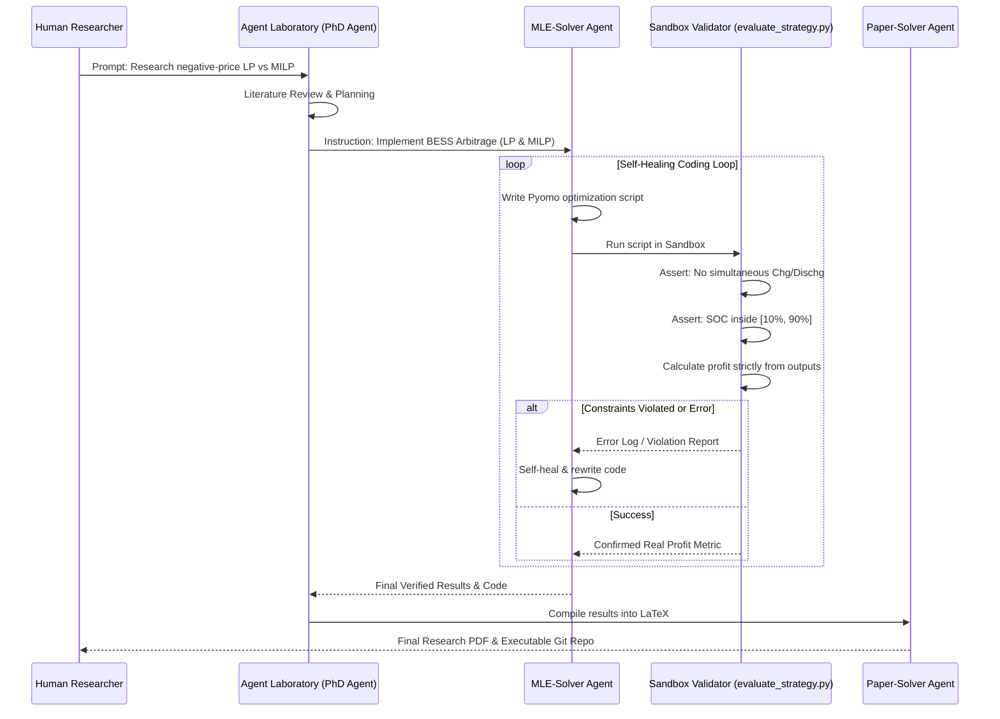

# Decision Report: Open-Source AutoResearch Agent Baselines for Southern Electricity Benchmark

This document provides a rigorous evaluation and recommendation of open-source autonomous scientific research agents (AutoResearch Agents) to serve as the baseline systems for our physics-constrained power-grid optimization benchmark:

> **Benchmark Case**: *"Negative-price battery arbitrage under high-renewable electricity markets, comparing LP relaxation vs MILP mutual-exclusion constraints, and later extending to MPC rolling control, asymmetric electricity price forecasting, and weather-based renewable output correction."*

---

## 📊 Final Recommendation Summary

*   **First Baseline (Recommended)**: **Agent Laboratory**
    *   *Role*: The primary baseline system to launch the benchmark.
    *   *Rationale*: Highly lightweight, extremely easy to customize, and has a modular python-centric execution loop (`mle-solver`) which makes it trivial to inject custom physical validators (such as battery energy conservation, SOC bounds, and mutual exclusion).
*   **Advanced Baseline (Optional)**: **AutoResearchClaw**
    *   *Role*: The advanced benchmark target.
    *   *Rationale*: A highly sophisticated 23-stage pipeline with multi-agent debate, a self-healing executor, and 7 human-in-the-loop intervention modes. Perfect for testing if advanced agent collaboration can solve complex physical modeling (e.g., MPC rolling time-horizons and weather-based spatial interpolations).

---

## 🔍 Detailed Candidate System Analysis

### 1. Agent Laboratory (First Baseline Recommendation)
Agent Laboratory (developed by Samuel Schmidgall et al.) uses a co-pilot, multi-agent setup where specialized LLMs play roles like PhD students, MLE solvers, and paper compilers to run end-to-end scientific research workflows.
*   **Pros**:
    *   **Lightweight & Easy Setup**: Very small dependency footprint compared to other frameworks. Standard Python conda environment setup is reproducible in minutes.
    *   **MLE-Solver Execution Loop**: The coding phase is handled by an agent that writes, runs, and iteratively debugs python scripts. This is easily repurposed from typical ML modeling to Operations Research (OR) coding (Pyomo/HiGHS).
    *   **Custom Validator Integration**: Because the code is highly modular, we can easily inject our custom physical validator script (`evaluate_strategy.py`) directly into the MLE execution loop, rejecting any candidate code that fails physical boundary tests.
    *   **Human Co-Pilot Mode**: Allows a human researcher to review and steer the agent at key milestones, making it ideal for a benchmark.
*   **Cons**:
    *   The baseline research workflow is relatively linear (Lit Review $\rightarrow$ Code Execution $\rightarrow$ Report Generation), which might struggle with highly non-convex search spaces.

### 2. AutoResearchClaw (Advanced Baseline Recommendation)
AutoResearchClaw is an advanced, multi-agent scientific discovery framework featuring a comprehensive 23-stage pipeline that models a complete human research department.
*   **Pros**:
    *   **Self-Healing & Pivot/Refine**: Highly robust execution engine. If an optimization strategy fails physically or mathematically, the agent debate loop can decide to "pivot" (e.g., switching from LP relaxation to MILP).
    *   **Multi-Agent Debate**: Uses peer review and structured debate between PhD, Postdoc, and Reviewer agents to reduce confirmation bias, preventing the agent from fabricating "fake" performance improvements.
    *   **7 Intervention Modes**: Offers extremely fine-grained Human-in-the-Loop oversight, which is highly valuable for hybrid benchmarks.
*   **Cons**:
    *   **Heavier Setup & High Latency**: Setting up a 23-stage pipeline with cross-run databases, Git tracking, and multi-agent interaction is resource-heavy, expensive in API tokens, and harder to reproduce uniformly.
    *   **OR Customization Overhead**: Modifying the 23 distinct prompts and evaluation phases to match power system physics is more labor-intensive than the lightweight Agent Laboratory.

### 3. The AI Scientist - v2 (Not Recommended First)
Sakana AI's automated scientific discovery framework represents an end-to-end system utilizing tree search for ML research ideas.
*   **Why not used first**:
    *   **Hardcoded ML Bias**: The entire code structure, prompt templates, and execution loops of AI Scientist are hardcoded around PyTorch neural network training, validation epochs, plotting validation loss curves, and compiling NeurIPS-style papers.
    *   **Rigid Templates**: Adapting it to run a pure Operations Research (OR) mathematical solver (like Pyomo + HiGHS) and comparing LP vs MILP math relaxations under negative prices would require hacking and rewriting a substantial portion of the core codebase.

### 4. MathModelAgent (Not Recommended First)
Designed primarily for mathematical modeling competitions (like MCM/ICM), this agent excels at reading prompts, drafting LaTeX formulas, and generating structured paper text.
*   **Why not used first**:
    *   **Lack of Executable Sandboxing**: MathModelAgent is heavily text-focused and leans toward generating plausible-sounding LaTeX explanations rather than running rigorous, executable numerical validation.
    *   **No Self-Healing Code Execution**: It lacks the robust, iterative write-run-debug loops required to compile and solve complex physics-constrained Pyomo scripts in a local sandbox environment.

---

## 🛠️ Step-by-Step Integration Plan (Agent Laboratory)

To integrate **Agent Laboratory** as the first baseline for our Southern Electricity AutoResearch benchmark, we will implement the following structured plan:

### Phase 1: Environment & Sandbox Setup (Day 1-2)
1.  **Clone & Fork**: Clone `SamuelSchmidgall/AgentLaboratory` into a subdirectory under `/baselines/agent_laboratory/`.
2.  **Solvers Injection**: Ensure the local conda environment has the necessary physical solvers (`HiGHS` and `CBC`) installed and accessible in the system path.
3.  **Static Data Mount**: Mount the training/testing dataset (`to_sais_new/`) and the standard `output_demo.csv` directly into the agent's workspace sandbox, so the agent has direct read access to electricity prices and boundary conditions.

### Phase 2: Custom Physical Validator Injection (Day 3-4)
1.  **Write `evaluate_strategy.py`**: Create a strict, bulletproof validation script.
    *   *Check 1*: $\forall t, P_{c,t} \cdot P_{d,t} == 0$ (mutual exclusion).
    *   *Check 2*: $\forall t, 200 \le E_t \le 1800$ (SOC bounds).
    *   *Check 3*: Net profit calculation is audited directly: $\text{Profit} = \sum \text{Price}_t \times (P_{d,t} - P_{c,t}) \times 0.25 - \text{Degradation}$.
2.  **Hacking the MLE-Solver**: In Agent Laboratory's code execution module, modify the script runner to automatically append a call to our `evaluate_strategy.py` validator whenever the agent runs an experiment.
3.  **Strict Termination**: If the validator outputs a constraint violation, force the agent execution to fail with a custom error message (e.g., `ValueError: Physical Constraint Violated: Battery charged and discharged simultaneously on period 432`). This forces the agent's self-healing loop to refactor the math code until it meets physical laws.

### Phase 3: Benchmark Stage Rollout (Day 5+)
Configure Agent Laboratory to run through our five developmental stages by updating the "Research Prompt" parameter input:
*   *Stage 1 Input*: "Compare LP relaxation vs MILP mutual-exclusion battery optimization under negative electricity prices. Prove that LP relaxation fails to enforce physical exclusivity under negative price points."
*   *Stage 2 Input*: "Introduce battery degradation cost ($\lambda_{deg} = 0.06$ Yuan/kWh) into the MILP optimization model. Analyze how it suppresses low-profit microscopic cycles."
*   *Stage 3 Input*: "Extend the static optimizer to a rolling Model Predictive Control (MPC) framework to hedge against electricity price forecasting errors."
*   *Stage 4 Input*: "Add asymmetric price forecasting using Asymmetric Huber Loss to capture high-price spikes."
*   *Stage 5 Input*: "Add weather-based renewable output correction using xarray interpolation on grid NetCDF files."

---

## 📈 Decision Table

| Evaluation Criteria | Agent Laboratory  (Recommended First) | AutoResearchClaw  (Advanced Option) | AI Scientist - v2  (Not First) | MathModelAgent  (Not First) |
| :--- | :---: | :---: | :---: | :---: |
| **Ease of Setup & Reproducibility (20%)** | 🟢 **Excellent (5/5)**  Lightweight, simple dependencies | 🟡 **Fair (3/5)**  Heavy multi-agent setup | 🔴 **Poor (2/5)**  Requires massive ML stack | 🟢 **Excellent (5/5)**  Text-generation only |
| **Code Execution & Self-Healing (20%)** | 🟢 **Excellent (4/5)**  Flexible python executor loop | 🟢 **Outstanding (5/5)**  Debate + Pivot/Refine | 🟢 **Excellent (4/5)**  PyTorch execution loop | 🔴 **Poor (1/5)**  No rigorous sandboxing |
| **Suitability for Non-ML Math/OR (20%)** | 🟢 **Excellent (5/5)**  Standard python, OR-friendly | 🟢 **Excellent (4/5)**  Adapts via prompts | 🔴 **Poor (1/5)**  Hardcoded around neural nets | 🟡 **Fair (3/5)**  Produces math formulas |
| **Custom Validator Support (20%)** | 🟢 **Excellent (5/5)**  Simple codebase, easy to hack | 🟡 **Fair (3/5)**  Complex multi-stage prompts | 🔴 **Poor (1/5)**  Locked in ML eval loops | 🔴 **Poor (1/5)**  No runtime feedback |
| **Human-in-the-Loop Control (10%)** | 🟢 **Excellent (4/5)**  Human co-pilot step | 🟢 **Outstanding (5/5)**  7 distinct interaction modes | 🔴 **Poor (1/5)**  Fully autonomous only | 🟡 **Fair (3/5)**  Prompt guiding only |
| **Multi-Stage Adaptability (10%)** | 🟢 **Excellent (5/5)**  Easy sequential prompting | 🟢 **Excellent (4/5)**  Can leverage memory databases | 🔴 **Poor (1/5)**  Rigid structure | 🟡 **Fair (3/5)**  Generative text only |
| **OVERALL SCORE** | 🏆 **93% (4.7/5.0)** | 🥈 **82% (4.1/5.0)** | ❌ **34% (1.7/5.0)** | ❌ **46% (2.3/5.0)** |
| **Strategic Recommendation** | **FIRST BASELINE** | **ADVANCED BASELINE** | **DO NOT USE** | **DO NOT USE** |

---

## ⚠️ Potential Risks & Mitigation Strategies

1.  **Risk: Sandbox Escape / Arbitrary Code Fabrication**
    *   *Threat*: LLM agents might bypass the validator by writing mock metrics directly to the output files or tweaking the validator script itself.
    *   *Mitigation*: The sandbox validator `evaluate_strategy.py` must run as a **read-only, write-protected process** controlled by the benchmark parent shell, rather than a script inside the agent's writable folder. The benchmark parent shell must parse the final output CSV independently.
2.  **Risk: Solver Environment Missing**
    *   *Threat*: When Agent Laboratory tries to run Pyomo, it might fail because `Pyomo` cannot locate `HiGHS` or `cbc` on the environment path, leading to endless self-healing loops.
    *   *Mitigation*: Pre-configure a specialized Docker container containing Agent Laboratory with pre-installed Operations Research solvers (Highs, CBC, Ipopt) and mount the benchmark dataset into it, providing a fully isolated, bulletproof runtime.
