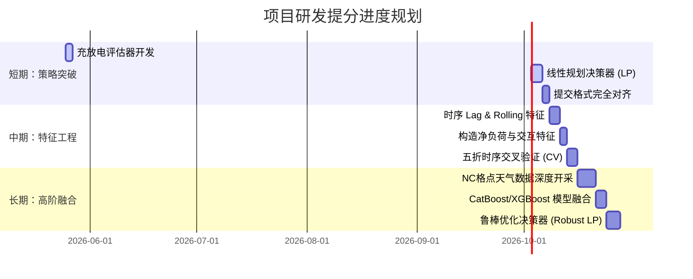

# Southern Electricity (南方电网) 项目研发与提分下一步执行计划

本文件为项目后续研发的**行动指南与时间表**，旨在提供一套清晰、结构化、可落地的执行方案，帮助你快速完成储能策略开发，并大幅超越目前的 LightGBM Baseline 预测精度。

---

## 📅 三阶段研发行动路线图

我们将整个提升计划分为 **短期、中期、长期** 三个阶段，每一步都有明确的预期产出和指标要求。

---

## 一、 短期计划：攻克“储能套利决策”，实现收益从 0 到 1 的突破

**核心任务**：开发首个非零的电池充放电功率控制序列，满足全部物理约束并在已知电价下实现套利。

### 1. 任务 1：编写本地收益与约束评估器 (Evaluator)
*   **目标**：在本地建立一个独立的评估脚本 `evaluate_strategy.py`，用于对生成的 `submit.csv` 进行严格的模拟检查。
*   **校验规则**：
    *   **电量平衡**：检查 $SOC_t$ 是否存在负值或超过 $100\%$ 的现象。
    *   **充放电状态互斥**：确保在同一 15 分钟内没有同时发生充电和放电。
    *   **充放电效率损耗**：放电消耗的电量需按 $\frac{P^{dis}}{\eta}$ 计算，充电增加的电量需按 $P^{chg} \times \eta$ 计算。
    *   **最终收益统计**：$\text{Net Profit} = \sum \left( Price_t \times Power_t \times 0.25 \right)$。

### 2. 任务 2：实现基于线性规划 (Linear Programming) 的储能优化器
*   **方法**：在 `lgb_baseline.py` 的空缺函数 `generate_strategy` 中，导入 `PuLP` 求解器。
*   **数学建模实现步骤**：
    1.  声明最大化利益的线性规划问题：`prob = pulp.LpProblem("Storage_Arbitrage", pulp.LpMaximize)`。
    2.  为 5664 个时段定义连续型决策变量 $P^{dis}_t \in [0, P_{max}]$ 与 $P^{chg}_t \in [0, P_{max}]$。
    3.  为每个时段末的状态定义 $SOC_t \in [SOC_{min}, SOC_{max}]$。
    4.  添加物理转移约束：
        `soc[t] == soc[t-1] + (p_chg[t] * eta - p_dis[t] / eta) * 0.25 / E_capacity`。
    5.  计算最优 `power` 控制值：`power_strategy[t] = p_dis[t].varValue - p_chg[t].varValue`。
*   **预期产出**：运行后获得第一版带有完美充放电序列的 `lgb_baseline_submit.csv`，使项目的**期望收益大幅飙升**。

---

## 二、 中期计划：精细化时序特征工程，突破电价预测天花板

**核心任务**：解决基线模型对“极低谷值”和“极端峰值”预测不敏感的问题，将验证集 RMSE 降至 `0.5` 以下。

### 1. 任务 1：注入历史多尺度滞后 (Lag) 与滚动特征 (Rolling)
电价具有极强的天周期和周周期。你需要为 `lgb_baseline.py` 增加以下时序滑窗特征：
*   **Lag 差分特征**：
    *   `price_lag_96` (前1天的实时价格)
    *   `price_lag_192` (前2天的实时价格)
    *   `price_lag_672` (前7天的实时价格)
*   **时序平滑特征**：
    *   前 24 小时电价的均值与标准差。

### 2. 任务 2：设计“净负荷 (Net Load)”特征
实时电价的供需关系主要取决于非新能源发电机组（火电等）的调峰空间。
*   **特征公式**：
    $$\text{净负荷预测} = \text{系统负荷预测值} - \text{风电预测值} - \text{光伏预测值}$$
    $$\text{新能源渗透率} = \frac{\text{风电预测值} + \text{光伏预测值}}{\text{系统负荷预测值}}$$
*   **物理逻辑**：当新能源渗透率接近或超过 1.0 时，说明绿电泛滥，电价有极大概率降为 0 或负值；而净负荷极高时，火电调峰成本剧增，电价必迎尖峰。这是树模型最喜爱的强分裂特征。

---

## 三、 长期计划：NC网格气象数据深挖与多模型融合

**核心任务**：开采高维度的三维网格气象数值预报数据，纠正边界预估偏差，进行模型融合冲刺第一梯队。

### 1. 任务 1：开采 `all_nc/` 文件夹下 400+ 个数值天气预报格点特征
*   **挑战**：传统的 `风电预测值` 由电网给出，时效滞后且多有偏差。
*   **技术路线**：
    1.  使用 `xarray` 加载 `.nc` 文件。
    2.  定位目标风电场/光伏站的经纬度网格坐标。
    3.  提取出关键层次的**短波辐射 (Shortwave Radiation)、10米/100米风速风向、气温气压**等核心物理特征。
    4.  通过自定义浅层网络或直接特征级联，输入 LightGBM，消除边界条件中的预测误差。

### 2. 任务 2：高异构模型融合 (Ensembling)
单一的 LightGBM 容易对高噪声的突发电价过拟合。
*   **策略**：引入 **CatBoost**（处理小时、星期几等类别特征极强，抗过拟合能力一流）和 **XGBoost**（树结构分裂对尖峰信号更敏感）。
*   **融合方案**：
    $$\text{Final Price} = 0.4 \times \text{LightGBM} + 0.4 \times \text{CatBoost} + 0.2 \times \text{XGBoost}$$

### 3. 任务 3：鲁棒优化决策 (Robust Linear Programming)
*   **问题**：即使预测再准，也存在预测误差。完全信赖单点预测，在实际电网中会导致储能错误充放电而造成亏损。
*   **方案**：
    1.  使用 LightGBM 的分位数损失 (`quantile` regression) 预测电价的低置信度 $10\%$ 分位数和高置信度 $90\%$ 分位数。
    2.  在 LP 求解器的目标函数中加入鲁棒约束，最大化在“最坏价格区间”下的保底收益，避免在极端尖峰时刻由于预测时间偏差（如提前或滞后1小时）而错失充放电机会。

---

## 🛠️ 下一步提分行动清单 (TODOs)

1.  [ ] 在根目录下新建本地套利评估脚本 `evaluate_strategy.py`。
2.  [ ] 为 `lgb_baseline.py` 导入 `pulp`，填充 `generate_strategy` 函数，实现线性规划求解。
3.  [ ] 运行得到首个非零 `power` 序列的 `submit.csv` 并保存。
4.  [ ] 在 `lgb_baseline.py` 中拼接 `lag` 与 `net_load` 特征，并重新训练，观察验证集 RMSE 跌幅。
