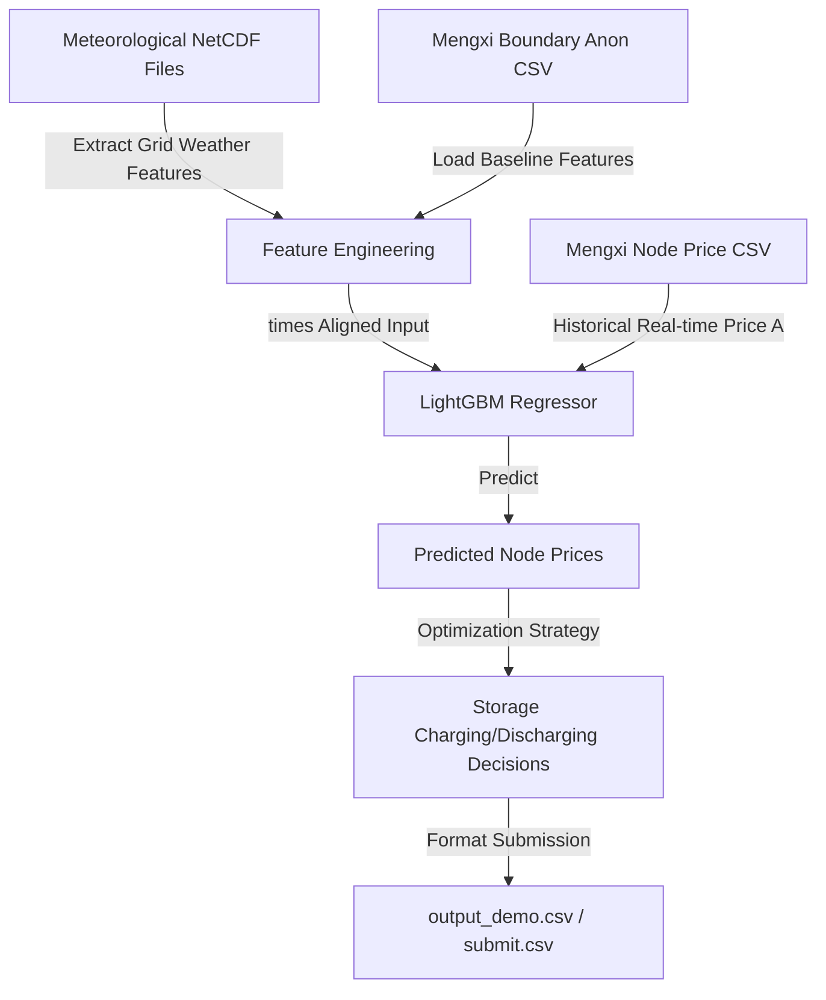

# Southern Electricity (南方电网/电力市场) 电价预测与储能优化项目概览

本文件旨在深入拆解当前项目的整体定位、数据流向、核心代码实现，并分析目前的开发进度及未来的演进方向。

---

## 一、 项目整体定位与任务背景

在新型电力系统建设中，由于风电、光伏等新能源出力的强波动性与不确定性，电力市场的电价波动剧烈。在此背景下，本项目属于典型的**综合决策优化问题**，包含两个阶段的任务：

1. **第一阶段：电价预测 (Regression Task)**  
   利用历史与未来的电网边界条件预测值（系统负荷、各类电源预测出力、联络线预测值等），在每个 $15\text{分钟}$ 时段预测实时节点电价 $A$。该预测精度直接决定了后续收益方案的成败。
2. **第二阶段：储能决策控制 (Optimization Task)**  
   基于预测出的实时价格曲线，在满足储能电站（如锂电池组）的物理约束（如电池最大/最小容量 SOC、最大充放电功率限制、充放电效率损耗）的前提下，设计**最大化充放电净收益**的控制功率 `power` 序列。



---

## 二、 核心文件作用与具体代码深度拆解

当前项目根目录下包含以下核心资产：

```
Southern_Electricity/
├── docs/                               # 归档文档与可视化进度面板
│   ├── project_overview.md             # 本文件：详尽的代码与架构剖析
│   └── progress_dashboard.html         # 精美的可视化仪表盘（支持浏览器直接打开）
├── to_sais_new/to_sais_new/            # 数据集目录
│   ├── train/                          # 训练集特征与标签
│   ├── test/                           # 测试集特征
│   └── all_nc/                         # 气象数值预报格点 NC 数据
├── outputs/                            # 各种模型输出与评估图表
│   ├── output_price/                   # 预测的电价结果（中间文件与对齐后的提交文件）
│   ├── output_power/                   # 储能决策输出
│   └── figures/                        # 自动生成的4大诊断评估图表
├── lgb_baseline.py                     # LightGBM 预测基线脚本
├── analyze_baseline.py                 # 基线可视化、误差分析与格式校验脚本
└── output_demo.csv                     # 官方提交流程格式示例
```

### 1. `lgb_baseline.py` (预测核心)

该脚本建立了基于树模型的机器学习预测流水线，预测的核心是根据未来的电网边界状态给出电价预测值。

#### 核心代码解读：

*   **数据内连接对齐 (Merge)**：
    ```python
    df_feat = pd.read_csv(train_feature_path)
    df_label = pd.read_csv(train_label_path)
    df_train = pd.merge(df_feat, df_label, on='times', how='inner')
    ```
    *   **解析**：训练特征和电价标签在采集时可能存在时间漂移。使用基于 `times` 字段的 `inner` 内连接对齐，确保每一条训练数据的特征与标签在同一时间刻度上。
*   **时序特征工程 (Time Features)**：
    ```python
    def add_time_features(df):
        df = df.copy()
        df['hour'] = df['times'].dt.hour
        df['minute'] = df['times'].dt.minute
        df['dayofweek'] = df['times'].dt.dayofweek
        df['month'] = df['times'].dt.month
        return df
    ```
    *   **解析**：实时电价带有强烈的日周期性（如午间光伏大发时出现电价极小值，早晚用电高峰出现电价尖峰）和周周期性（工作日与周末负荷需求不同）。提取 `hour`、`minute`、`dayofweek` 等时间轴特征能让 LightGBM 捕捉这些周期规律。
*   **基于时间顺序的数据划分 (Time-based Split)**：
    ```python
    split_idx = int(len(X) * 0.8)
    X_train, X_val = X[:split_idx], X[split_idx:]
    y_train, y_val = y[:split_idx], y[split_idx:]
    ```
    *   **解析**：**极为关键的时序数据划分规则**。不能采用普通的随机划分，否则会发生“未来信息泄漏”（即拿明天的电价规律去“预测”昨天的电价）。这里采用严格的前 80% 作为历史训练集，后 20% 作为模拟未来验证集。
*   **储能策略生成器 (空缺)**：
    ```python
    def generate_strategy(price_csv, save_path="output_profit_15min.csv"):
        """根据预测的实时价格确定充放电策略，此处略"""
        pass
    ```
    *   **解析**：当前基线中该函数为空。这是后续开发中最重要的收益增长点。

---

### 2. `analyze_baseline.py` (校验与分析核武器)

这是一个极其健壮的调试脚本，作用是校验文件格式并在本地闭环评估基线模型的缺陷，防止脏数据或错误格式上线。

#### 核心代码与逻辑解读：

*   **格式对齐校验**：
    ```python
    df_pred = pd.read_csv(pred_path)
    df_demo = pd.read_csv(demo_path)
    row_match = df_pred.shape[0] == df_demo.shape[0]
    time_match = (df_pred['times'].values == df_demo['times'].values).all()
    ```
    *   **解析**：验证预测结果在行数、时间戳上是否与标准模版 `output_demo.csv` 完全一致，确保提交文件不会被评测系统拒绝。
*   **4大诊断图表生成**：
    1.  **`fig1_prediction_distribution.png` (预测值分布图)**：
        对比验证集真实电价直方图与测试集预测电价直方图，检查模型是否预测出了合理的数值范围，是否存在预测值过于集中或出现不合理极值（如负电价过多）的现象。
    2.  **`fig2_true_vs_predicted.png` (真实值 vs 预测值时间曲线)**：
        截取前 3 周（2016个15分钟点），用双曲线形式直接展现模型在波峰波谷的拟合能力。可以清晰地看出，当前的 LightGBM 容易对“极端电价尖峰”发生**低估（Under-prediction）**。
    3.  **`fig3_error_over_time.png` (滚动误差变化图)**：
        通过绘制滚动 1 天的 RMSE/MAE 以及正负偏差充填，反映预测器随时间变化的鲁棒性，定位模型在哪几天发生了集体失准。
    4.  **`fig4_hourly_mae_rmse.png` (分时误差柱状图)**：
        按每天的 24 个小时统计 MAE/RMSE。通常，电价在 10:00-14:00（新能源大发段）和 18:00-21:00（晚高峰段）波动最剧烈，此图可以量化模型在高峰段的预测表现。
*   **格式化生成提交流水线**：
    自动将列名重构为标准的 `实时价格` 并创建全为 `0.0` 的充放电功率 `power` 列，最终生成 `lgb_baseline_submit.csv` 以保证提流程畅通。

---

### 3. 数据集解析与特征库潜力

*   **`mengxi_boundary_anon_filtered.csv` (7维基线预测特征)**：
    *   `系统负荷预测值`：电网总需求，与电价正相关。
    *   `风光总加预测值`、`风电预测值`、`光伏预测值`：新能源大发会压低实时电价，甚至导致零电价/负电价。
    *   `水电预测值`、`非市场化机组预测值`：电网的基础支撑出力。
    *   `联络线预测值`：跨区外送或购入电力，代表外部市场的电力传输冲击。
*   **`all_nc/*.nc` (高阶三维时空气象特征库，价值巨大)**：
    *   这里包含了历史到未来的丰富数值天气预报数据（如网格的风速、风向、短波辐射强度、温度、湿度等）。
    *   **深度价值**：电网边界的“风电预测值”和“光伏预测值”往往存在系统偏差。通过直接在这些 `.nc` 网格数据上提取关键区域的物理特征（如日照辐射、平均风速），我们可以自己建立更准的“新能源实际出力预测模型”，以此纠正边界条件中的偏差，使电价预测的精度更上一层楼。

---

## 三、 当前项目进度与开发路线图

### 📊 当前进度面板

| 研发阶段 | 任务模块 | 进度 | 技术实现方式 |
| :--- | :--- | :--- | :--- |
| **第一阶段** | 数据读取、清洗与时间戳对齐 | `[xxxxxxxxx]` 100% | `pandas.merge` 进行 times 关联，提取时序周期特征。 |
| **第二阶段** | LightGBM 电价预测基线 | `[xxxxxxxxx]` 100% | 80/20 时间切分，使用 RMSE 损失训练。**已测得本地 Validation RMSE: 0.5763, MAE: 0.4186**。 |
| **第三阶段** | 提交流水线格式化与自动诊断校验 | `[xxxxxxxxx]` 100% | 自动化脚本 `analyze_baseline.py` 绘制4大诊断图并自动生成兼容的 submit CSV。 |
| **第四阶段** | **储能控制决策优化 (充放电 power 计算)** | `[---------]` 0% | *待开发*。目前默认 power 填 0.0（不操作，零收益）。计划引入贪心策略或数学规划（如 `PuLP`/`SciPy.optimize` 线性规划）求解最优 SOC 控制。 |
| **第五阶段** | **气象网格 NC 文件高阶特征工程** | `[---------]` 0% | *待开发*。计划使用 `xarray` 从 400 多个天气 NetCDF 文件中抽取经纬度网格气象特征。 |
| **第六阶段** | **电价预测算法调优与多模型融合** | `[---------]` 0% | *待开发*。探究 CatBoost/XGBoost 模型，引入电价的历史滞后特征（Lag features）以缓解模型低估波峰的问题。 |

---

## 四、 下一步核心开发建议

### 1. 攻克储能策略（Task 4）
目前 `power` 全部为零，代表储能电站完全处于闲置状态，项目收益为零。
*   **首期方案 (贪心启发式算法)**：找出预测电价的局部极小值（谷电价）进行充电（`power < 0`），并在后续的局部极大值（峰电价）进行放电（`power > 0`），保证每次充放电均能套利。
*   **二期方案 (线性规划/混合整数规划 MIP)**：
    使用数学规划器定义目标函数：$\max \sum (Price_t \times Power_t \times \Delta t)$。
    约束条件：
    1.  容量约束：$SOC_{min} \le SOC_t \le SOC_{max}$
    2.  充放电平衡：$SOC_{t} = SOC_{t-1} - Power_t \times \eta \times \Delta t$（充电时 $\eta$ 为效率，放电时除以 $\eta$）
    3.  功率约束：$-P_{max} \le Power_t \le P_{max}$
    4.  日循环次数约束或充放电次数限制。

### 2. 引入时序特征以捕捉尖峰（Task 6）
根据诊断图 `fig2_true_vs_predicted.png` 的反馈，当前的 LightGBM 对电价的“突发尖峰”极度不敏感。
*   **解决方案**：引入电价的历史均值、历史滑动标准差等特征，或者采用**分位数回归 (Quantile Regression)** 预测电价的概率区间，专门对高电价区进行加权惩罚，从而使模型具有更好的抗电价冲击能力。
